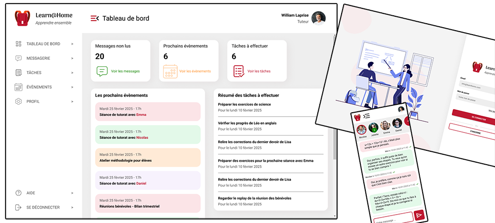

# Projet 10 : Learn@Home (Définissez les besoins pour une app de soutien scolaire)

## Présentation

Ce projet consiste à définir les besoins pour une application web de soutien scolaire, dédiée à l'association **Learn@Home**. Cette plateforme fictive met en relation des enfants en difficulté scolaire avec des tuteurs bénévoles.

## Objectifs pédagogiques

- Créer une maquette pour un client
- Identifier les besoins de l'application à partir d'un cahier des charges
- Modéliser une solution technique pour un client
- Contribuer à un projet en utilisant une méthodologie agile

## Livrables

Les livrables pour ce projet sont les suivants :

1. **Diagrammes de cas d’usage** : Représentation des cas d’usage pour chaque fonctionnalité majeure de la plateforme (connexion, chat, calendrier, gestion des tâches, tableau de bord).
2. **User stories avec critères d'acceptation** : Descriptions fonctionnelles des attentes des utilisateurs pour chaque fonctionnalité, accompagnées de critères d'acceptation.
3. **Maquettes du site** : Des maquettes pour desktop et mobile illustrant l'interface utilisateur et la navigation entre les différentes pages.
4. **Kanban de découpage du projet** : Découpage macro du projet en blocs de fonctionnalités et sous-fonctionnalités, afin de préparer le développement futur.

## Technologies utilisées

- **GitHub Projects** : Pour le tableau Kanban.
- **Figma** : Pour la conception des maquettes
- **Draw.io** : Pour la création des diagrammes de cas d’usage.

## Liens vers les fichiers

- 📄 [Diagrammes de cas d'usage (pdf)](user_cases.pdf)
- 📄 [User stories (pdf)](user_stories.pdf)
- 🎨 [Maquettes (Lien Figma)](https://www.figma.com/design/1o3AaYp1Bi0LNXNz8eJsmW/Learn%40Home)
- 🗂️ [Kanban (Lien GitHub Projects)](https://github.com/users/nrundstadler/projects/1)
